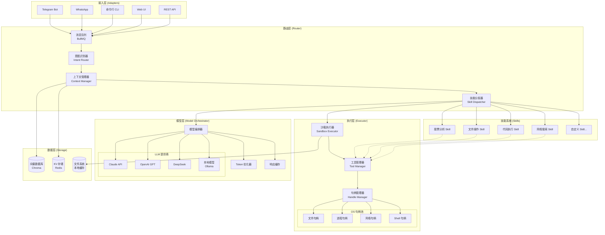
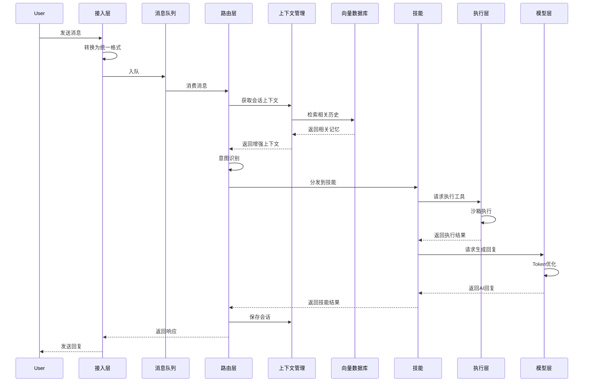
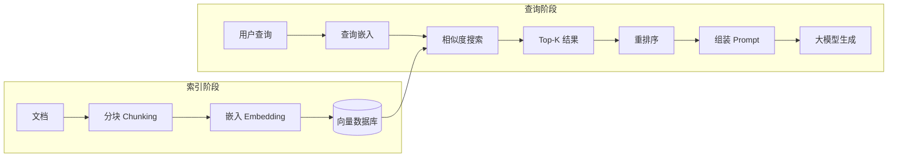
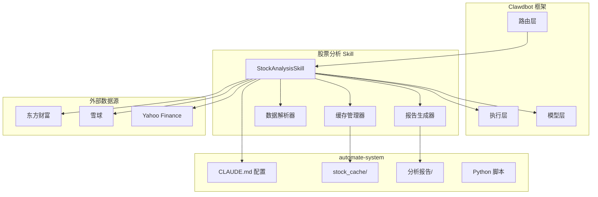
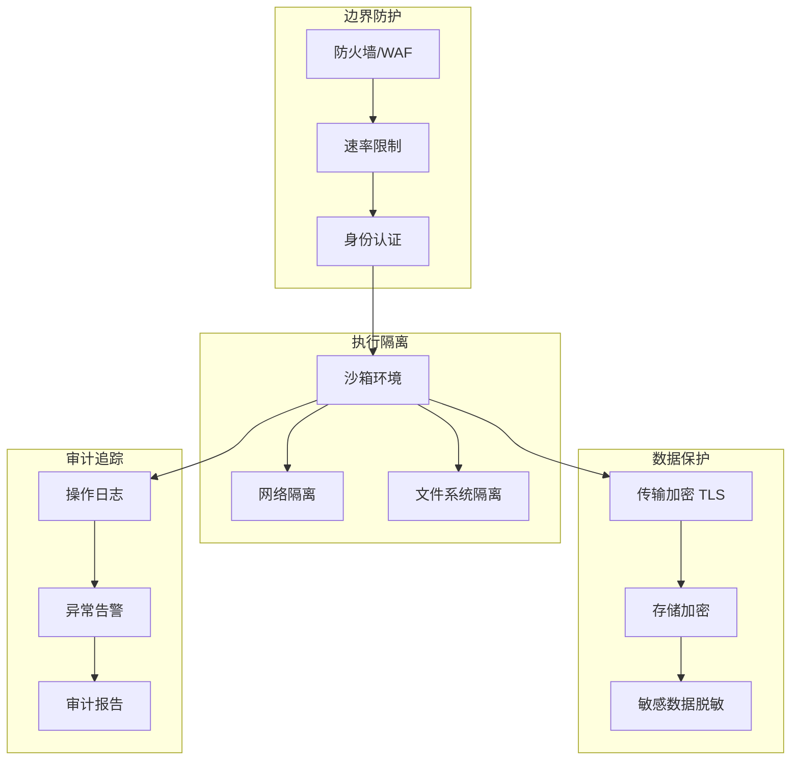

# Clawdbot 架构设计文档

> 版本: 1.0.0
> 更新日期: 2026-01-25
> 作者: Claude AI Agent

---

## 目录

1. [概述](#1-概述)
2. [系统架构](#2-系统架构)
3. [核心模块设计](#3-核心模块设计)
4. [数据流设计](#4-数据流设计)
5. [技能系统设计](#5-技能系统设计)
6. [部署架构](#6-部署架构)
7. [与 automate-system 整合方案](#7-与-automate-system-整合方案)
8. [安全设计](#8-安全设计)
9. [扩展路线图](#9-扩展路线图)

---

## 1. 概述

### 1.1 什么是 Clawdbot

Clawdbot 是一个基于 Node.js 的 AI 代理框架，其核心设计理念是**句柄式控制**——通过运行时将操作系统级别的句柄（文件、进程、网络）安全地暴露给大语言模型，使 AI 能够在受控环境中执行实际操作。

### 1.2 核心设计原则

| 原则 | 描述 |
|------|------|
| **句柄式控制** | OS 句柄通过 Node.js 运行时暴露，模型可直接操作文件、进程、网络 |
| **三层解耦** | 界面层、模型层、计算层完全独立，可独立替换和扩展 |
| **技能插件化** | 功能以 Skill 形式存在，支持热插拔和权限隔离 |
| **本地优先** | 数据和向量库存储在本地，保护隐私，降低延迟 |

### 1.3 技术选型

```
运行时:     Node.js 20+ LTS
包管理:     pnpm
向量数据库:  Chroma / LanceDB (本地)
消息队列:    BullMQ + Redis
沙箱:       vm2 / isolated-vm
容器化:     Docker + Docker Compose
```

---

## 2. 系统架构

### 2.1 整体架构图



### 2.2 分层职责

| 层级 | 职责 | 技术实现 |
|------|------|----------|
| **接入层** | 统一多平台消息格式，处理协议差异 | Adapter 模式 |
| **路由层** | 意图识别、会话管理、技能调度 | BullMQ + 状态机 |
| **执行层** | 工具调用、沙箱隔离、句柄管理 | vm2 + 权限控制 |
| **模型层** | 多模型编排、Token 优化、响应缓存 | 策略模式 |
| **数据层** | 向量检索、会话持久化、缓存 | Chroma + Redis |

---

## 3. 核心模块设计

### 3.1 接入层：多平台消息适配

#### 3.1.1 统一消息格式

```typescript
// types/message.ts
interface UnifiedMessage {
  id: string;                    // 消息唯一ID
  platform: Platform;            // 来源平台
  channelId: string;             // 频道/群组ID
  userId: string;                // 用户ID
  content: MessageContent;       // 消息内容
  timestamp: Date;               // 时间戳
  replyTo?: string;              // 回复的消息ID
  metadata: Record<string, any>; // 平台特定元数据
}

type Platform = 'telegram' | 'whatsapp' | 'cli' | 'web' | 'api';

interface MessageContent {
  type: 'text' | 'image' | 'file' | 'voice' | 'command';
  text?: string;
  attachments?: Attachment[];
  command?: CommandPayload;
}
```

#### 3.1.2 适配器接口

```typescript
// adapters/base.ts
abstract class BaseAdapter {
  abstract platform: Platform;

  // 生命周期
  abstract connect(): Promise<void>;
  abstract disconnect(): Promise<void>;

  // 消息处理
  abstract onMessage(handler: MessageHandler): void;
  abstract sendMessage(channelId: string, content: MessageContent): Promise<void>;

  // 统一格式转换
  protected abstract toUnified(raw: any): UnifiedMessage;
  protected abstract fromUnified(msg: UnifiedMessage): any;
}
```

#### 3.1.3 Telegram 适配器示例

```typescript
// adapters/telegram.ts
import { Telegraf } from 'telegraf';

class TelegramAdapter extends BaseAdapter {
  platform = 'telegram' as const;
  private bot: Telegraf;

  constructor(token: string) {
    super();
    this.bot = new Telegraf(token);
  }

  async connect() {
    this.bot.launch();
  }

  onMessage(handler: MessageHandler) {
    this.bot.on('message', async (ctx) => {
      const unified = this.toUnified(ctx.message);
      const response = await handler(unified);
      if (response) {
        await ctx.reply(response.text);
      }
    });
  }

  protected toUnified(raw: any): UnifiedMessage {
    return {
      id: String(raw.message_id),
      platform: 'telegram',
      channelId: String(raw.chat.id),
      userId: String(raw.from.id),
      content: {
        type: 'text',
        text: raw.text || ''
      },
      timestamp: new Date(raw.date * 1000),
      metadata: { raw }
    };
  }
}
```

### 3.2 路由层：意图识别 + 技能分发

#### 3.2.1 意图识别器

```typescript
// router/intent.ts
interface IntentResult {
  skill: string;           // 匹配的技能名称
  confidence: number;      // 置信度 0-1
  entities: Entity[];      // 提取的实体
  params: Record<string, any>; // 技能参数
}

class IntentRouter {
  private patterns: Map<string, RegExp[]>;
  private llmFallback: boolean;

  constructor(config: IntentConfig) {
    this.patterns = new Map();
    this.llmFallback = config.llmFallback ?? true;
    this.loadPatterns(config.skills);
  }

  async recognize(message: UnifiedMessage): Promise<IntentResult> {
    // 1. 规则匹配（快速路径）
    const ruleMatch = this.matchByRules(message.content.text);
    if (ruleMatch && ruleMatch.confidence > 0.8) {
      return ruleMatch;
    }

    // 2. LLM 意图识别（慢速路径）
    if (this.llmFallback) {
      return this.matchByLLM(message);
    }

    return { skill: 'default', confidence: 0.5, entities: [], params: {} };
  }

  private matchByRules(text: string): IntentResult | null {
    // 股票分析触发词
    const stockPatterns = [
      /分析\s*(.+?)\s*股票/,
      /看看\s*(.+)/,
      /(.+?)\s*怎么样/,
      /刷新\s*(.+?)\s*数据/,
      /(.+?)\s*vs\s*(.+)/i
    ];

    for (const pattern of stockPatterns) {
      const match = text.match(pattern);
      if (match) {
        return {
          skill: 'stock-analysis',
          confidence: 0.95,
          entities: [{ type: 'stock', value: match[1] }],
          params: { symbol: match[1], compare: match[2] }
        };
      }
    }
    return null;
  }

  private async matchByLLM(message: UnifiedMessage): Promise<IntentResult> {
    // 使用小模型快速分类
    const prompt = `
分析用户意图，返回JSON格式：
{"skill": "技能名", "confidence": 0.0-1.0, "entities": [], "params": {}}

可用技能: stock-analysis, file-operation, code-execute, web-search, chat

用户消息: ${message.content.text}
`;
    // 调用模型层...
    return JSON.parse(await this.llm.complete(prompt));
  }
}
```

#### 3.2.2 技能分发器

```typescript
// router/dispatcher.ts
class SkillDispatcher {
  private skills: Map<string, Skill>;
  private executor: SandboxExecutor;

  async dispatch(intent: IntentResult, context: ConversationContext): Promise<SkillResult> {
    const skill = this.skills.get(intent.skill);

    if (!skill) {
      return { success: false, error: 'Skill not found' };
    }

    // 权限检查
    if (!this.checkPermission(context.userId, skill.requiredPermissions)) {
      return { success: false, error: 'Permission denied' };
    }

    // 在沙箱中执行
    return this.executor.run(skill, intent.params, context);
  }
}
```

### 3.3 执行层：工具调用 + 沙箱隔离

#### 3.3.1 句柄管理器

```typescript
// executor/handles.ts
class HandleManager {
  private fileHandles: Map<string, FileHandle>;
  private processHandles: Map<string, ChildProcess>;
  private networkHandles: Map<string, Socket>;

  // 文件句柄
  async openFile(path: string, mode: OpenMode): Promise<FileHandle> {
    const handle = await fs.open(path, mode);
    const id = crypto.randomUUID();
    this.fileHandles.set(id, handle);
    return { id, handle };
  }

  async readFile(handleId: string): Promise<Buffer> {
    const handle = this.fileHandles.get(handleId);
    if (!handle) throw new Error('Invalid handle');
    return handle.readFile();
  }

  // 进程句柄
  async spawn(command: string, args: string[]): Promise<ProcessHandle> {
    const proc = spawn(command, args, { stdio: 'pipe' });
    const id = crypto.randomUUID();
    this.processHandles.set(id, proc);
    return { id, process: proc };
  }

  // 清理
  async cleanup(sessionId: string) {
    // 关闭该会话的所有句柄
    for (const [id, handle] of this.fileHandles) {
      if (id.startsWith(sessionId)) {
        await handle.close();
        this.fileHandles.delete(id);
      }
    }
  }
}
```

#### 3.3.2 沙箱执行器

```typescript
// executor/sandbox.ts
import { VM } from 'vm2';

class SandboxExecutor {
  private handleManager: HandleManager;
  private timeout: number = 30000; // 30秒超时

  async run(skill: Skill, params: any, context: ConversationContext): Promise<SkillResult> {
    const vm = new VM({
      timeout: this.timeout,
      sandbox: {
        // 注入安全的 API
        console: this.createSafeConsole(),
        fetch: this.createSafeFetch(skill.allowedDomains),
        fs: this.createSafeFS(skill.allowedPaths),
        params,
        context: this.sanitizeContext(context),

        // 句柄操作 API
        handles: {
          openFile: (path: string) => this.handleManager.openFile(path, 'r'),
          readFile: (id: string) => this.handleManager.readFile(id),
          writeFile: (id: string, data: Buffer) => this.handleManager.writeFile(id, data),
          spawn: (cmd: string, args: string[]) => this.handleManager.spawn(cmd, args),
        }
      }
    });

    try {
      const result = await vm.run(skill.code);
      return { success: true, data: result };
    } catch (error) {
      return { success: false, error: error.message };
    } finally {
      await this.handleManager.cleanup(context.sessionId);
    }
  }

  private createSafeFS(allowedPaths: string[]) {
    return {
      readFile: async (path: string) => {
        if (!allowedPaths.some(p => path.startsWith(p))) {
          throw new Error(`Access denied: ${path}`);
        }
        return fs.readFile(path, 'utf-8');
      },
      writeFile: async (path: string, content: string) => {
        if (!allowedPaths.some(p => path.startsWith(p))) {
          throw new Error(`Access denied: ${path}`);
        }
        return fs.writeFile(path, content);
      }
    };
  }
}
```

### 3.4 模型层：多模型编排 + Token 优化

#### 3.4.1 模型编排器

```typescript
// models/orchestrator.ts
interface ModelConfig {
  provider: 'anthropic' | 'openai' | 'deepseek' | 'ollama';
  model: string;
  apiKey?: string;
  baseUrl?: string;
  maxTokens: number;
  temperature: number;
}

class ModelOrchestrator {
  private models: Map<string, LLMClient>;
  private defaultModel: string;
  private tokenOptimizer: TokenOptimizer;

  constructor(configs: ModelConfig[]) {
    for (const config of configs) {
      this.models.set(config.model, this.createClient(config));
    }
  }

  async complete(
    messages: Message[],
    options?: CompletionOptions
  ): Promise<CompletionResult> {
    // 选择模型
    const modelName = options?.model || this.selectModel(messages);
    const client = this.models.get(modelName);

    // Token 优化
    const optimizedMessages = await this.tokenOptimizer.optimize(messages, {
      maxTokens: client.maxTokens,
      strategy: options?.tokenStrategy || 'truncate'
    });

    // 检查缓存
    const cacheKey = this.getCacheKey(optimizedMessages);
    const cached = await this.cache.get(cacheKey);
    if (cached && !options?.noCache) {
      return cached;
    }

    // 调用模型
    const result = await client.complete(optimizedMessages);

    // 缓存结果
    await this.cache.set(cacheKey, result, { ttl: 3600 });

    return result;
  }

  private selectModel(messages: Message[]): string {
    // 根据任务复杂度选择模型
    const complexity = this.assessComplexity(messages);

    if (complexity === 'high') {
      return 'claude-opus-4-5-20251101'; // 复杂推理
    } else if (complexity === 'medium') {
      return 'claude-sonnet-4-20250514'; // 平衡
    } else {
      return 'deepseek-chat'; // 简单任务，成本低
    }
  }
}
```

#### 3.4.2 Token 优化器

```typescript
// models/token-optimizer.ts
class TokenOptimizer {
  private encoder: TiktokenEncoder;

  async optimize(messages: Message[], options: OptimizeOptions): Promise<Message[]> {
    const totalTokens = this.countTokens(messages);

    if (totalTokens <= options.maxTokens) {
      return messages;
    }

    switch (options.strategy) {
      case 'truncate':
        return this.truncateOldMessages(messages, options.maxTokens);

      case 'summarize':
        return this.summarizeHistory(messages, options.maxTokens);

      case 'rag':
        return this.retrieveRelevant(messages, options.maxTokens);

      default:
        return messages;
    }
  }

  private async summarizeHistory(messages: Message[], maxTokens: number): Promise<Message[]> {
    // 保留系统消息和最近3轮对话
    const systemMsg = messages.find(m => m.role === 'system');
    const recentMsgs = messages.slice(-6);
    const historyMsgs = messages.slice(1, -6);

    if (historyMsgs.length === 0) {
      return messages;
    }

    // 用小模型总结历史
    const summary = await this.llm.complete([
      { role: 'system', content: '请简洁总结以下对话要点，保留关键信息：' },
      { role: 'user', content: historyMsgs.map(m => `${m.role}: ${m.content}`).join('\n') }
    ]);

    return [
      systemMsg,
      { role: 'system', content: `[历史摘要] ${summary}` },
      ...recentMsgs
    ].filter(Boolean);
  }
}
```

---

## 4. 数据流设计

### 4.1 消息处理流程



### 4.2 上下文管理策略

#### 4.2.1 上下文结构

```typescript
// context/types.ts
interface ConversationContext {
  sessionId: string;
  userId: string;
  platform: Platform;

  // 短期记忆：最近的对话轮次
  shortTermMemory: Message[];

  // 长期记忆：向量化的历史摘要
  longTermMemory: MemoryEntry[];

  // 工作记忆：当前任务状态
  workingMemory: {
    currentSkill?: string;
    pendingActions: Action[];
    variables: Record<string, any>;
  };

  // 用户画像
  userProfile: UserProfile;

  // 会话配置
  config: SessionConfig;
}

interface MemoryEntry {
  id: string;
  content: string;
  embedding: number[];
  timestamp: Date;
  importance: number;
  metadata: Record<string, any>;
}
```

#### 4.2.2 上下文管理器

```typescript
// context/manager.ts
class ContextManager {
  private shortTermLimit = 10;  // 最近10轮对话
  private vectorDB: ChromaClient;
  private redis: Redis;

  async getContext(sessionId: string): Promise<ConversationContext> {
    // 1. 从 Redis 获取短期记忆
    const shortTerm = await this.redis.lrange(`session:${sessionId}:messages`, 0, this.shortTermLimit);

    // 2. 从向量库检索长期记忆
    const lastMessage = shortTerm[0];
    const longTerm = await this.retrieveRelevantMemories(sessionId, lastMessage);

    // 3. 获取用户画像
    const profile = await this.redis.hgetall(`user:${sessionId}:profile`);

    return {
      sessionId,
      shortTermMemory: shortTerm.map(JSON.parse),
      longTermMemory: longTerm,
      workingMemory: await this.getWorkingMemory(sessionId),
      userProfile: profile,
      config: await this.getConfig(sessionId)
    };
  }

  async saveMessage(sessionId: string, message: Message) {
    // 1. 保存到短期记忆
    await this.redis.lpush(`session:${sessionId}:messages`, JSON.stringify(message));
    await this.redis.ltrim(`session:${sessionId}:messages`, 0, this.shortTermLimit * 2);

    // 2. 定期归档到长期记忆
    if (await this.shouldArchive(sessionId)) {
      await this.archiveToLongTerm(sessionId);
    }
  }

  private async archiveToLongTerm(sessionId: string) {
    // 获取待归档消息
    const messages = await this.redis.lrange(`session:${sessionId}:messages`, this.shortTermLimit, -1);

    // 生成摘要
    const summary = await this.llm.summarize(messages);

    // 生成向量并存储
    const embedding = await this.embeddings.embed(summary);
    await this.vectorDB.add({
      collection: `user:${sessionId}`,
      documents: [summary],
      embeddings: [embedding],
      metadatas: [{ timestamp: Date.now(), messageCount: messages.length }]
    });

    // 清理已归档消息
    await this.redis.ltrim(`session:${sessionId}:messages`, 0, this.shortTermLimit);
  }

  private async retrieveRelevantMemories(sessionId: string, query: string): Promise<MemoryEntry[]> {
    const embedding = await this.embeddings.embed(query);
    const results = await this.vectorDB.query({
      collection: `user:${sessionId}`,
      queryEmbeddings: [embedding],
      nResults: 5
    });
    return results.documents.map((doc, i) => ({
      id: results.ids[i],
      content: doc,
      embedding: results.embeddings[i],
      timestamp: new Date(results.metadatas[i].timestamp),
      importance: results.distances[i],
      metadata: results.metadatas[i]
    }));
  }
}
```

### 4.3 RAG 检索增强流程



---

## 5. 技能系统设计

### 5.1 插件接口规范

#### 5.1.1 Skill 基类

```typescript
// skills/base.ts
interface SkillManifest {
  name: string;
  version: string;
  description: string;
  author: string;

  // 触发条件
  triggers: {
    patterns: string[];      // 正则表达式
    intents: string[];       // 意图标签
    commands: string[];      // 命令前缀
  };

  // 权限要求
  permissions: Permission[];

  // 资源限制
  limits: {
    timeout: number;         // 执行超时（ms）
    memory: number;          // 内存限制（MB）
    fileAccess: string[];    // 允许访问的路径
    networkAccess: string[]; // 允许访问的域名
  };

  // 依赖
  dependencies: {
    skills: string[];        // 依赖的其他技能
    tools: string[];         // 依赖的工具
  };
}

abstract class BaseSkill {
  abstract manifest: SkillManifest;

  // 生命周期钩子
  async onLoad(): Promise<void> {}
  async onUnload(): Promise<void> {}

  // 核心执行方法
  abstract execute(params: any, context: ConversationContext): Promise<SkillResult>;

  // 可选：流式输出
  async *executeStream(params: any, context: ConversationContext): AsyncGenerator<SkillChunk> {
    const result = await this.execute(params, context);
    yield { type: 'complete', data: result };
  }

  // 工具访问（由框架注入）
  protected tools: ToolManager;
  protected llm: ModelOrchestrator;
  protected storage: StorageManager;
}
```

#### 5.1.2 Skill 结果类型

```typescript
// skills/types.ts
interface SkillResult {
  success: boolean;
  data?: any;
  error?: string;

  // 响应内容
  response?: {
    text?: string;
    markdown?: string;
    html?: string;
    attachments?: Attachment[];
  };

  // 后续动作
  followUp?: {
    suggestions: string[];     // 建议的后续问题
    actions: Action[];         // 可执行的动作按钮
  };

  // 上下文更新
  contextUpdate?: {
    variables?: Record<string, any>;
    userProfile?: Partial<UserProfile>;
  };
}

interface SkillChunk {
  type: 'text' | 'data' | 'progress' | 'complete' | 'error';
  data: any;
}
```

### 5.2 权限控制

#### 5.2.1 权限定义

```typescript
// permissions/types.ts
enum Permission {
  // 文件系统
  FILE_READ = 'file:read',
  FILE_WRITE = 'file:write',
  FILE_DELETE = 'file:delete',

  // 进程
  PROCESS_SPAWN = 'process:spawn',
  PROCESS_KILL = 'process:kill',

  // 网络
  NETWORK_HTTP = 'network:http',
  NETWORK_WEBSOCKET = 'network:websocket',

  // 系统
  SYSTEM_ENV = 'system:env',
  SYSTEM_EXEC = 'system:exec',

  // 模型
  MODEL_EXPENSIVE = 'model:expensive',  // 使用昂贵模型
  MODEL_UNLIMITED = 'model:unlimited',  // 无 Token 限制

  // 用户数据
  USER_PROFILE = 'user:profile',
  USER_HISTORY = 'user:history',
}

interface PermissionPolicy {
  skill: string;
  user?: string;
  permissions: Permission[];
  conditions?: {
    timeRange?: { start: string; end: string };
    rateLimit?: { requests: number; window: number };
    pathPattern?: string[];
  };
}
```

#### 5.2.2 权限检查器

```typescript
// permissions/checker.ts
class PermissionChecker {
  private policies: PermissionPolicy[];

  async check(
    skill: string,
    user: string,
    permission: Permission,
    resource?: string
  ): Promise<boolean> {
    // 1. 查找适用的策略
    const policy = this.findPolicy(skill, user);
    if (!policy) return false;

    // 2. 检查基本权限
    if (!policy.permissions.includes(permission)) {
      return false;
    }

    // 3. 检查条件
    if (policy.conditions) {
      // 时间范围
      if (policy.conditions.timeRange) {
        const now = new Date();
        const { start, end } = policy.conditions.timeRange;
        if (now < new Date(start) || now > new Date(end)) {
          return false;
        }
      }

      // 速率限制
      if (policy.conditions.rateLimit) {
        const count = await this.getRateCount(skill, user);
        if (count >= policy.conditions.rateLimit.requests) {
          return false;
        }
      }

      // 路径模式
      if (policy.conditions.pathPattern && resource) {
        const matched = policy.conditions.pathPattern.some(
          p => minimatch(resource, p)
        );
        if (!matched) return false;
      }
    }

    return true;
  }
}
```

### 5.3 Skill 注册与发现

```typescript
// skills/registry.ts
class SkillRegistry {
  private skills: Map<string, BaseSkill> = new Map();
  private skillsDir: string;

  async loadAll() {
    const files = await fs.readdir(this.skillsDir);
    for (const file of files) {
      if (file.endsWith('.skill.js') || file.endsWith('.skill.ts')) {
        await this.loadSkill(path.join(this.skillsDir, file));
      }
    }
  }

  async loadSkill(skillPath: string) {
    const module = await import(skillPath);
    const SkillClass = module.default;
    const skill = new SkillClass();

    // 验证 manifest
    this.validateManifest(skill.manifest);

    // 注入依赖
    skill.tools = this.toolManager;
    skill.llm = this.modelOrchestrator;
    skill.storage = this.storageManager;

    // 调用生命周期钩子
    await skill.onLoad();

    // 注册
    this.skills.set(skill.manifest.name, skill);
    console.log(`Skill loaded: ${skill.manifest.name} v${skill.manifest.version}`);
  }

  async unloadSkill(name: string) {
    const skill = this.skills.get(name);
    if (skill) {
      await skill.onUnload();
      this.skills.delete(name);
    }
  }

  getSkill(name: string): BaseSkill | undefined {
    return this.skills.get(name);
  }

  findByTrigger(text: string): BaseSkill[] {
    const matches: BaseSkill[] = [];
    for (const skill of this.skills.values()) {
      for (const pattern of skill.manifest.triggers.patterns) {
        if (new RegExp(pattern).test(text)) {
          matches.push(skill);
          break;
        }
      }
    }
    return matches;
  }
}
```

---

## 6. 部署架构

### 6.1 目录结构

```
clawdbot/
├── src/
│   ├── adapters/           # 接入层适配器
│   │   ├── telegram.ts
│   │   ├── whatsapp.ts
│   │   ├── cli.ts
│   │   └── web.ts
│   ├── router/             # 路由层
│   │   ├── intent.ts
│   │   ├── dispatcher.ts
│   │   └── queue.ts
│   ├── executor/           # 执行层
│   │   ├── sandbox.ts
│   │   ├── handles.ts
│   │   └── tools.ts
│   ├── models/             # 模型层
│   │   ├── orchestrator.ts
│   │   ├── clients/
│   │   │   ├── anthropic.ts
│   │   │   ├── openai.ts
│   │   │   └── ollama.ts
│   │   └── optimizer.ts
│   ├── context/            # 上下文管理
│   │   ├── manager.ts
│   │   └── memory.ts
│   ├── permissions/        # 权限控制
│   │   └── checker.ts
│   └── index.ts
├── skills/                 # 技能目录
│   ├── stock-analysis/     # 股票分析技能
│   ├── file-ops/
│   ├── code-exec/
│   └── web-search/
├── config/
│   ├── default.yaml
│   ├── production.yaml
│   └── skills.yaml
├── data/
│   ├── chroma/            # 向量数据库
│   └── cache/             # 缓存文件
├── docker/
│   ├── Dockerfile
│   └── docker-compose.yml
├── scripts/
│   ├── install.sh
│   └── start.sh
├── package.json
└── tsconfig.json
```

### 6.2 Linux 命令行部署

#### 6.2.1 安装脚本

```bash
#!/bin/bash
# scripts/install.sh

set -e

echo "=== Clawdbot Installation ==="

# 检查 Node.js
if ! command -v node &> /dev/null; then
    echo "Installing Node.js 20 LTS..."
    curl -fsSL https://deb.nodesource.com/setup_20.x | sudo -E bash -
    sudo apt-get install -y nodejs
fi

# 检查 pnpm
if ! command -v pnpm &> /dev/null; then
    echo "Installing pnpm..."
    npm install -g pnpm
fi

# 检查 Redis
if ! command -v redis-server &> /dev/null; then
    echo "Installing Redis..."
    sudo apt-get install -y redis-server
    sudo systemctl enable redis-server
    sudo systemctl start redis-server
fi

# 安装依赖
echo "Installing dependencies..."
pnpm install

# 初始化配置
if [ ! -f config/local.yaml ]; then
    echo "Creating local config..."
    cp config/default.yaml config/local.yaml
    echo "Please edit config/local.yaml with your API keys"
fi

# 初始化向量数据库目录
mkdir -p data/chroma data/cache

# 编译 TypeScript
echo "Building..."
pnpm build

echo "=== Installation Complete ==="
echo "Run './scripts/start.sh' to start Clawdbot"
```

#### 6.2.2 启动脚本

```bash
#!/bin/bash
# scripts/start.sh

set -e

# 加载环境变量
if [ -f .env ]; then
    export $(cat .env | xargs)
fi

# 启动参数
MODE=${1:-"production"}
CONFIG="config/${MODE}.yaml"

echo "Starting Clawdbot in ${MODE} mode..."

# 检查 Redis
if ! pgrep -x "redis-server" > /dev/null; then
    echo "Starting Redis..."
    redis-server --daemonize yes
fi

# 启动应用
if [ "$MODE" = "development" ]; then
    # 开发模式：热重载
    pnpm dev
else
    # 生产模式：PM2 管理
    if ! command -v pm2 &> /dev/null; then
        npm install -g pm2
    fi

    pm2 start dist/index.js \
        --name clawdbot \
        --max-memory-restart 1G \
        --log-date-format "YYYY-MM-DD HH:mm:ss" \
        -- --config $CONFIG

    pm2 save
    echo "Clawdbot started. Use 'pm2 logs clawdbot' to view logs."
fi
```

#### 6.2.3 Systemd 服务

```ini
# /etc/systemd/system/clawdbot.service
[Unit]
Description=Clawdbot AI Agent
After=network.target redis.service

[Service]
Type=simple
User=clawdbot
WorkingDirectory=/opt/clawdbot
ExecStart=/usr/bin/node dist/index.js --config config/production.yaml
Restart=always
RestartSec=10
Environment=NODE_ENV=production

# 资源限制
MemoryLimit=2G
CPUQuota=200%

[Install]
WantedBy=multi-user.target
```

### 6.3 Docker Compose 编排

#### 6.3.1 Dockerfile

```dockerfile
# docker/Dockerfile
FROM node:20-alpine AS builder

WORKDIR /app

# 安装 pnpm
RUN npm install -g pnpm

# 安装依赖
COPY package.json pnpm-lock.yaml ./
RUN pnpm install --frozen-lockfile

# 编译
COPY . .
RUN pnpm build

# 生产镜像
FROM node:20-alpine

WORKDIR /app

# 安装 pnpm
RUN npm install -g pnpm

# 只复制生产依赖
COPY package.json pnpm-lock.yaml ./
RUN pnpm install --frozen-lockfile --prod

# 复制编译产物
COPY --from=builder /app/dist ./dist
COPY --from=builder /app/skills ./skills
COPY config ./config

# 创建数据目录
RUN mkdir -p data/chroma data/cache

# 非 root 用户
RUN addgroup -g 1001 clawdbot && \
    adduser -D -u 1001 -G clawdbot clawdbot && \
    chown -R clawdbot:clawdbot /app
USER clawdbot

EXPOSE 3000

CMD ["node", "dist/index.js", "--config", "config/production.yaml"]
```

#### 6.3.2 Docker Compose

```yaml
# docker/docker-compose.yml
version: '3.8'

services:
  clawdbot:
    build:
      context: ..
      dockerfile: docker/Dockerfile
    container_name: clawdbot
    restart: unless-stopped
    ports:
      - "3000:3000"
    environment:
      - NODE_ENV=production
      - REDIS_URL=redis://redis:6379
      - CHROMA_URL=http://chroma:8000
    volumes:
      - ./config/local.yaml:/app/config/local.yaml:ro
      - clawdbot-data:/app/data
      - clawdbot-skills:/app/skills
    depends_on:
      - redis
      - chroma
    networks:
      - clawdbot-network
    deploy:
      resources:
        limits:
          memory: 2G
          cpus: '2'

  redis:
    image: redis:7-alpine
    container_name: clawdbot-redis
    restart: unless-stopped
    volumes:
      - redis-data:/data
    networks:
      - clawdbot-network
    command: redis-server --appendonly yes

  chroma:
    image: chromadb/chroma:latest
    container_name: clawdbot-chroma
    restart: unless-stopped
    volumes:
      - chroma-data:/chroma/chroma
    networks:
      - clawdbot-network
    environment:
      - ANONYMIZED_TELEMETRY=False

  # 可选：Web UI
  web:
    image: nginx:alpine
    container_name: clawdbot-web
    restart: unless-stopped
    ports:
      - "80:80"
      - "443:443"
    volumes:
      - ./nginx.conf:/etc/nginx/nginx.conf:ro
      - ./web:/usr/share/nginx/html:ro
      - ./certs:/etc/nginx/certs:ro
    depends_on:
      - clawdbot
    networks:
      - clawdbot-network

volumes:
  clawdbot-data:
  clawdbot-skills:
  redis-data:
  chroma-data:

networks:
  clawdbot-network:
    driver: bridge
```

#### 6.3.3 部署命令

```bash
# 构建并启动
docker-compose -f docker/docker-compose.yml up -d --build

# 查看日志
docker-compose -f docker/docker-compose.yml logs -f clawdbot

# 重启服务
docker-compose -f docker/docker-compose.yml restart clawdbot

# 更新镜像
docker-compose -f docker/docker-compose.yml pull
docker-compose -f docker/docker-compose.yml up -d

# 查看资源使用
docker stats clawdbot clawdbot-redis clawdbot-chroma
```

---

## 7. 与 automate-system 整合方案

### 7.1 整合架构



### 7.2 股票分析 Skill 实现

```typescript
// skills/stock-analysis/index.ts
import { BaseSkill, SkillManifest, SkillResult } from '../../src/skills/base';
import { StockCache } from './cache';
import { StockDataFetcher } from './fetcher';
import { ReportGenerator } from './reporter';

export default class StockAnalysisSkill extends BaseSkill {
  manifest: SkillManifest = {
    name: 'stock-analysis',
    version: '1.0.0',
    description: '股票分析技能 - 支持 A 股、港股、美股的行情分析',
    author: 'Clawdbot',

    triggers: {
      patterns: [
        '分析\\s*(.+?)\\s*股票',
        '看看\\s*(.+)',
        '(.+?)\\s*怎么样',
        '刷新\\s*(.+?)\\s*数据',
        '(.+?)\\s*vs\\s*(.+)',
        '最近分析过哪些股票'
      ],
      intents: ['stock_analysis', 'stock_compare', 'stock_refresh'],
      commands: ['/stock', '/analyze', '/refresh']
    },

    permissions: [
      'file:read',
      'file:write',
      'network:http'
    ],

    limits: {
      timeout: 60000,
      memory: 256,
      fileAccess: ['./stock_cache/*', './reports/*'],
      networkAccess: [
        'quote.eastmoney.com',
        'xueqiu.com',
        'finance.yahoo.com',
        'investing.com'
      ]
    },

    dependencies: {
      skills: [],
      tools: ['web-fetch', 'file-system']
    }
  };

  private cache: StockCache;
  private fetcher: StockDataFetcher;
  private reporter: ReportGenerator;

  async onLoad() {
    this.cache = new StockCache('./stock_cache');
    this.fetcher = new StockDataFetcher();
    this.reporter = new ReportGenerator(this.llm);
    await this.cache.loadIndex();
  }

  async execute(params: any, context: ConversationContext): Promise<SkillResult> {
    const { action, symbol, compareWith, forceRefresh } = this.parseParams(params);

    switch (action) {
      case 'analyze':
        return this.analyzeStock(symbol, forceRefresh);
      case 'compare':
        return this.compareStocks(symbol, compareWith);
      case 'list':
        return this.listAnalyzed();
      default:
        return { success: false, error: '未知操作' };
    }
  }

  private parseParams(params: any) {
    const text = params.text || params.symbol || '';

    // 检查是否是对比请求
    const vsMatch = text.match(/(.+?)\s*vs\s*(.+)/i);
    if (vsMatch) {
      return {
        action: 'compare',
        symbol: this.normalizeSymbol(vsMatch[1].trim()),
        compareWith: this.normalizeSymbol(vsMatch[2].trim())
      };
    }

    // 检查是否是刷新请求
    if (text.includes('刷新') || text.includes('更新') || params.refresh) {
      return {
        action: 'analyze',
        symbol: this.normalizeSymbol(text.replace(/刷新|更新|数据/g, '').trim()),
        forceRefresh: true
      };
    }

    // 检查是否是列表请求
    if (text.includes('最近分析') || text.includes('哪些股票')) {
      return { action: 'list' };
    }

    // 默认为分析请求
    return {
      action: 'analyze',
      symbol: this.normalizeSymbol(text.replace(/分析|看看|怎么样|股票/g, '').trim())
    };
  }

  private normalizeSymbol(input: string): string {
    // 常见股票名称映射
    const nameMap: Record<string, string> = {
      '比亚迪': '002594.SZ',
      '茅台': '600519.SS',
      '贵州茅台': '600519.SS',
      '特斯拉': 'TSLA',
      '苹果': 'AAPL',
      '腾讯': '0700.HK',
      '阿里': 'BABA',
      '阿里巴巴': 'BABA',
      // 更多映射...
    };

    if (nameMap[input]) {
      return nameMap[input];
    }

    // 自动推断市场
    if (/^\d{6}$/.test(input)) {
      if (input.startsWith('6') || input.startsWith('68')) {
        return `${input}.SS`;  // 上交所
      } else {
        return `${input}.SZ`;  // 深交所
      }
    }

    if (/^\d{4,5}$/.test(input)) {
      return `${input.padStart(5, '0')}.HK`;  // 港股
    }

    if (/^[A-Z]+$/i.test(input)) {
      return input.toUpperCase();  // 美股
    }

    return input;
  }

  private async analyzeStock(symbol: string, forceRefresh: boolean = false): Promise<SkillResult> {
    try {
      // 1. 检查缓存
      let stockData = await this.cache.get(symbol);

      if (!stockData || forceRefresh || this.isExpired(stockData)) {
        // 2. 获取新数据
        stockData = await this.fetcher.fetchAll(symbol);

        // 3. 写入缓存
        await this.cache.set(symbol, stockData);
      }

      // 4. 生成报告
      const report = await this.reporter.generate(stockData);

      // 5. 保存报告
      const reportPath = await this.saveReport(symbol, report);

      return {
        success: true,
        data: stockData,
        response: {
          markdown: report,
          attachments: [{
            type: 'file',
            path: reportPath,
            name: `${symbol}_分析报告.md`
          }]
        },
        followUp: {
          suggestions: [
            `刷新 ${stockData.name} 数据`,
            `${stockData.name} vs 竞争对手`,
            '查看更多分析报告'
          ]
        }
      };
    } catch (error) {
      return {
        success: false,
        error: `分析失败: ${error.message}`,
        response: {
          text: `抱歉，分析 ${symbol} 时出现错误：${error.message}`
        }
      };
    }
  }

  private isExpired(data: StockData): boolean {
    const now = Date.now();
    const updatedAt = new Date(data.updated_at).getTime();
    const limits = {
      price: 24 * 60 * 60 * 1000,      // 24小时
      fundamentals: 7 * 24 * 60 * 60 * 1000,  // 7天
      news: 6 * 60 * 60 * 1000,        // 6小时
      analyst: 3 * 24 * 60 * 60 * 1000 // 3天
    };

    // 检查各字段过期情况
    return (now - updatedAt) > limits.price;
  }

  private async compareStocks(symbol1: string, symbol2: string): Promise<SkillResult> {
    const [data1, data2] = await Promise.all([
      this.analyzeStock(symbol1),
      this.analyzeStock(symbol2)
    ]);

    if (!data1.success || !data2.success) {
      return {
        success: false,
        error: '获取股票数据失败'
      };
    }

    const comparison = await this.reporter.generateComparison(
      data1.data,
      data2.data
    );

    return {
      success: true,
      response: {
        markdown: comparison
      }
    };
  }

  private async listAnalyzed(): Promise<SkillResult> {
    const index = await this.cache.getIndex();
    const stocks = Object.entries(index)
      .map(([symbol, info]) => ({
        symbol,
        name: info.name,
        updatedAt: info.updated_at
      }))
      .sort((a, b) => new Date(b.updatedAt).getTime() - new Date(a.updatedAt).getTime())
      .slice(0, 10);

    const list = stocks.map(s =>
      `- **${s.name}** (${s.symbol}) - 更新于 ${new Date(s.updatedAt).toLocaleDateString()}`
    ).join('\n');

    return {
      success: true,
      response: {
        markdown: `## 最近分析的股票\n\n${list}`
      },
      followUp: {
        suggestions: stocks.slice(0, 3).map(s => `分析 ${s.name}`)
      }
    };
  }

  private async saveReport(symbol: string, report: string): Promise<string> {
    const date = new Date().toISOString().split('T')[0];
    const path = `./stock_cache/reports/${symbol}_${date}.md`;
    await this.storage.writeFile(path, report);
    return path;
  }
}
```

### 7.3 缓存管理器

```typescript
// skills/stock-analysis/cache.ts
interface CacheIndex {
  [symbol: string]: {
    name: string;
    updated_at: string;
    file: string;
  };
}

export class StockCache {
  private basePath: string;
  private indexPath: string;
  private index: CacheIndex = {};

  constructor(basePath: string) {
    this.basePath = basePath;
    this.indexPath = `${basePath}/cache_index.json`;
  }

  async loadIndex() {
    try {
      const content = await fs.readFile(this.indexPath, 'utf-8');
      this.index = JSON.parse(content);
    } catch {
      this.index = {};
    }
  }

  async get(symbol: string): Promise<StockData | null> {
    const entry = this.index[symbol];
    if (!entry) return null;

    try {
      const content = await fs.readFile(`${this.basePath}/data/${entry.file}`, 'utf-8');
      return JSON.parse(content);
    } catch {
      return null;
    }
  }

  async set(symbol: string, data: StockData) {
    const file = `${symbol}.json`;

    // 写入数据文件
    await fs.mkdir(`${this.basePath}/data`, { recursive: true });
    await fs.writeFile(
      `${this.basePath}/data/${file}`,
      JSON.stringify(data, null, 2)
    );

    // 更新索引
    this.index[symbol] = {
      name: data.name,
      updated_at: data.updated_at,
      file
    };
    await this.saveIndex();
  }

  async getIndex(): Promise<CacheIndex> {
    return this.index;
  }

  private async saveIndex() {
    await fs.writeFile(this.indexPath, JSON.stringify(this.index, null, 2));
  }
}
```

### 7.4 数据获取器

```typescript
// skills/stock-analysis/fetcher.ts
export class StockDataFetcher {
  async fetchAll(symbol: string): Promise<StockData> {
    const market = this.detectMarket(symbol);

    // 并行获取各类数据
    const [price, fundamentals, analyst, news] = await Promise.all([
      this.fetchPrice(symbol, market),
      this.fetchFundamentals(symbol, market),
      this.fetchAnalyst(symbol, market),
      this.fetchNews(symbol, market)
    ]);

    return {
      symbol,
      name: price.name,
      market,
      updated_at: new Date().toISOString(),
      price,
      fundamentals,
      analyst,
      news,
      capital_flow: await this.fetchCapitalFlow(symbol, market),
      technical: await this.fetchTechnical(symbol, market)
    };
  }

  private detectMarket(symbol: string): string {
    if (symbol.endsWith('.SS')) return 'A股沪市';
    if (symbol.endsWith('.SZ')) return 'A股深市';
    if (symbol.endsWith('.HK')) return '港股';
    if (/^[A-Z]+$/.test(symbol)) return '美股';
    return '未知';
  }

  private async fetchPrice(symbol: string, market: string): Promise<PriceData> {
    // 根据市场选择数据源
    if (market.startsWith('A股')) {
      return this.fetchFromEastmoney(symbol);
    } else if (market === '港股' || market === '美股') {
      return this.fetchFromYahoo(symbol);
    }
    throw new Error(`不支持的市场: ${market}`);
  }

  private async fetchFromEastmoney(symbol: string): Promise<PriceData> {
    // 调用东方财富 API
    const url = `https://quote.eastmoney.com/center/gridlist.html#hs_a_board`;
    const response = await fetch(url);
    // 解析数据...
    return {} as PriceData;
  }

  private async fetchFromYahoo(symbol: string): Promise<PriceData> {
    // 调用 Yahoo Finance API
    const url = `https://finance.yahoo.com/quote/${symbol}`;
    const response = await fetch(url);
    // 解析数据...
    return {} as PriceData;
  }

  // 其他获取方法...
}
```

### 7.5 报告生成器

```typescript
// skills/stock-analysis/reporter.ts
export class ReportGenerator {
  private llm: ModelOrchestrator;

  constructor(llm: ModelOrchestrator) {
    this.llm = llm;
  }

  async generate(data: StockData): Promise<string> {
    const prompt = `
基于以下股票数据生成专业分析报告：

${JSON.stringify(data, null, 2)}

请按以下格式输出：

## ${data.name} (${data.symbol}) 分析报告

### 📊 股价概览
- 现价、涨跌幅、52周区间
- 当前位置判断

### 📈 基本面分析
- 营收、利润及增速
- 毛利率、PE、PB
- 同比环比变化

### 🎯 机构观点
- 目标价区间
- 买入/卖出评级
- 潜在涨幅

### 💰 资金流向
- 主力/散户动向
- 北向资金情况

### ⚠️ 风险提示
- 技术面信号
- 需关注的风险点

---
数据更新时间: ${data.updated_at}
`;

    const response = await this.llm.complete([
      { role: 'system', content: '你是专业的股票分析师，请生成客观、专业的分析报告。' },
      { role: 'user', content: prompt }
    ]);

    return response.text;
  }

  async generateComparison(data1: StockData, data2: StockData): Promise<string> {
    const prompt = `
对比分析以下两只股票：

股票1: ${JSON.stringify(data1, null, 2)}
股票2: ${JSON.stringify(data2, null, 2)}

请从以下维度对比：
1. 估值水平
2. 成长性
3. 盈利能力
4. 机构评级
5. 投资建议
`;

    const response = await this.llm.complete([
      { role: 'system', content: '你是专业的股票分析师，请客观对比分析。' },
      { role: 'user', content: prompt }
    ]);

    return response.text;
  }
}
```

### 7.6 整合配置

```yaml
# config/skills.yaml
skills:
  stock-analysis:
    enabled: true
    config:
      cachePath: ./stock_cache
      reportPath: ./stock_cache/reports

      # 数据源优先级
      dataSources:
        aStock:
          - eastmoney
          - xueqiu
        hkStock:
          - yahoo
          - investing
        usStock:
          - yahoo
          - investing

      # 缓存有效期（秒）
      cacheExpiry:
        price: 86400        # 24小时
        fundamentals: 604800 # 7天
        news: 21600         # 6小时
        analyst: 259200     # 3天

      # 报告生成模型
      reportModel: claude-sonnet-4-20250514

    permissions:
      - file:read
      - file:write
      - network:http
```

---

## 8. 安全设计

### 8.1 安全架构



### 8.2 安全措施

| 层级 | 威胁 | 措施 |
|------|------|------|
| **接入层** | 未授权访问 | API Key + JWT 认证 |
| **接入层** | DDoS 攻击 | 速率限制 + IP 黑名单 |
| **执行层** | 代码注入 | vm2 沙箱 + 白名单 API |
| **执行层** | 资源耗尽 | 内存/CPU 限制 + 超时 |
| **模型层** | Prompt 注入 | 输入净化 + 角色锁定 |
| **数据层** | 数据泄露 | 加密存储 + 访问控制 |

### 8.3 敏感操作审批流程

```typescript
// security/approval.ts
class ApprovalManager {
  async requestApproval(
    operation: string,
    context: ConversationContext,
    details: any
  ): Promise<boolean> {
    // 高危操作需要用户确认
    const highRiskOps = [
      'file:delete',
      'process:kill',
      'system:exec',
      'model:expensive'
    ];

    if (highRiskOps.includes(operation)) {
      const confirmation = await this.askUser(context, {
        title: '操作确认',
        message: `即将执行 ${operation}，详情：${JSON.stringify(details)}`,
        options: ['确认', '取消']
      });
      return confirmation === '确认';
    }

    return true;
  }
}
```

---

## 9. 扩展路线图

### 9.1 短期目标（1-3 个月）

- [x] 核心框架搭建
- [x] Telegram 适配器
- [x] 股票分析 Skill
- [ ] CLI 适配器
- [ ] 基础权限系统
- [ ] Docker 部署

### 9.2 中期目标（3-6 个月）

- [ ] WhatsApp 适配器
- [ ] Web UI 控制台
- [ ] 插件市场
- [ ] 多租户支持
- [ ] 计费系统

### 9.3 长期目标（6-12 个月）

- [ ] 多 Agent 协作
- [ ] 工作流编排
- [ ] 自动化 DevOps
- [ ] 企业版功能
- [ ] 开源社区建设

---

## 附录

### A. 配置文件示例

```yaml
# config/default.yaml
server:
  port: 3000
  host: 0.0.0.0

adapters:
  telegram:
    enabled: true
    token: ${TELEGRAM_BOT_TOKEN}
  cli:
    enabled: true

models:
  default: claude-sonnet-4-20250514
  providers:
    anthropic:
      apiKey: ${ANTHROPIC_API_KEY}
      models:
        - claude-opus-4-5-20251101
        - claude-sonnet-4-20250514
    openai:
      apiKey: ${OPENAI_API_KEY}
      models:
        - gpt-4o
    deepseek:
      apiKey: ${DEEPSEEK_API_KEY}
      models:
        - deepseek-chat
    ollama:
      baseUrl: http://localhost:11434
      models:
        - llama3
        - mistral

storage:
  redis:
    url: redis://localhost:6379
  chroma:
    url: http://localhost:8000

security:
  sandbox:
    enabled: true
    timeout: 30000
    memoryLimit: 256MB
  rateLimit:
    windowMs: 60000
    maxRequests: 60
```

### B. 常用命令速查

```bash
# 开发
pnpm dev                    # 启动开发服务器
pnpm test                   # 运行测试
pnpm lint                   # 代码检查

# 部署
./scripts/install.sh        # 安装依赖
./scripts/start.sh          # 启动服务
./scripts/start.sh dev      # 开发模式启动

# Docker
docker-compose up -d        # 启动所有服务
docker-compose logs -f      # 查看日志
docker-compose restart      # 重启服务

# 管理
pm2 list                    # 查看进程
pm2 logs clawdbot          # 查看日志
pm2 restart clawdbot       # 重启服务
```

### C. 参考资料

- [Node.js 文档](https://nodejs.org/docs/)
- [Telegraf.js](https://telegraf.js.org/)
- [ChromaDB](https://docs.trychroma.com/)
- [vm2 沙箱](https://github.com/patriksimek/vm2)
- [Claude API](https://docs.anthropic.com/)

---

*文档版本: 1.0.0 | 最后更新: 2026-01-25*
